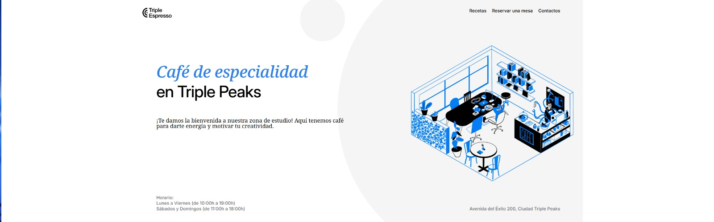
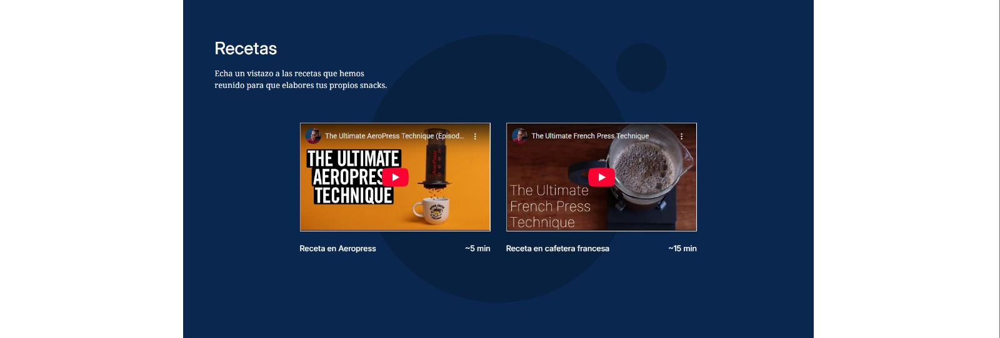
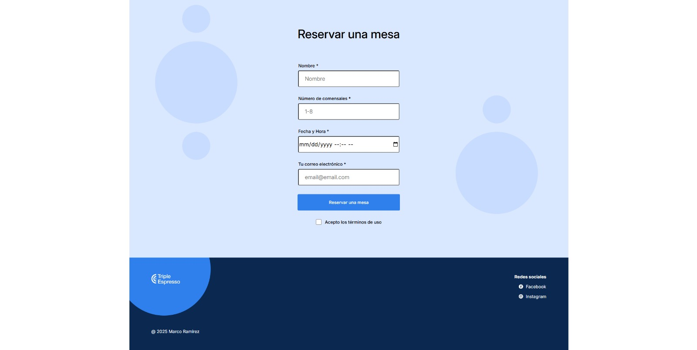

# Cafetería TripleTen

Es una **landing page frontend** para una cafetería de especialidad.  
El proyecto presenta información del negocio, recetas destacadas y un formulario de reservación, con un enfoque fuerte en **maquetación con Flexbox, diseño responsivo y estructura semántica**.

Este proyecto fue desarrollado como parte del **programa de Desarrollo Web de TripleTen**.

---

## Preview

## Descripción del Proyecto

La página simula el sitio oficial de una cafetería, permitiendo a los usuarios:

- Conocer el concepto del negocio
- Explorar recetas de café destacadas
- Realizar una reservación mediante un formulario
- Navegar por una interfaz limpia y clara

El objetivo principal del proyecto es demostrar **dominio del frontend puro**, especialmente en el uso de **Flexbox para layout**, formularios accesibles y buenas prácticas de HTML y CSS.

---

## Tecnologías Utilizadas

### HTML5

- Estructura semántica
- Uso correcto de formularios (`input`, `label`, `fieldset`)
- Navegación clara y organizada

### CSS3

- **Flexbox como principal sistema de layout**
- Diseño responsivo
- Organización visual mediante contenedores flexibles
- Jerarquía tipográfica y espaciado consistente
- Estilos limpios y enfocados en legibilidad

### JavaScript (básico)

- Validación y manejo de formularios
- Interacción básica del usuario
- Mejora de la experiencia sin depender de librerías externas

---

## Funcionalidades Principales

- Sección principal con presentación del negocio
- Sección de recetas destacadas
- Formulario de reservación con campos obligatorios
- Diseño completamente responsivo
- Navegación clara y estructurada

---

## Conceptos Aplicados

- Maquetación avanzada con Flexbox
- Diseño mobile-first
- Formularios accesibles y bien estructurados
- Separación de contenido y presentación
- Organización de estilos escalable

---
